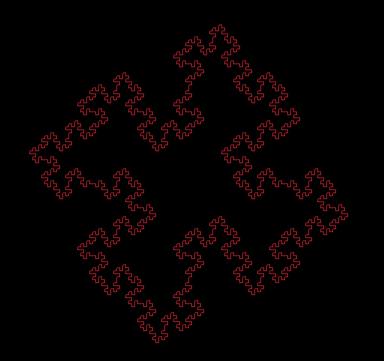

# Lindenmayer Systems

version: 0.01

> Lindenmayer systems (L-Systems) is a mathematical formalism that in practice should help up make models of plants and some fractals. L-Systems work with a given grammar, so that an axiom (initial sentence) is applied a set of grammatical rules to rewrite given axioms. And following drawing rules you will be able to see the plant, fractal or figure formed once applied.

# Usage (Not fully functional)

This is a visualizer of such systems.

To use the code you have to implement `init` from the Lindenmayer class to define the axiom, rules and delta angle like this:

```ruby
class ModifiedQuadraticKoch < Lindenmayer
  def init
    iterations 3
    angle 90

    grammar axiom: 'F+F+F+F'
    grammar_rule 'F', 'F+F-F-FF+F+F-F'
  end
end
```

So far you can only use rules with F+- and grouping doesn't work

## Modified Quadratic Koch



> As I continue to read this theory I'll update the code and make this simple viz cooler

# TODO

* Refactor
* Add start point
* Add (drawing) functionality for multiple set of rules
* CFG parsing for more complex examples
* Book of plants
* Book of fractals
