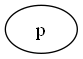
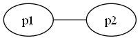
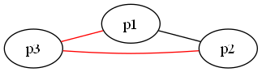
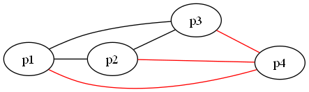

# [Handshake Problem](https://www.codewars.com/kata/5574835e3e404a0bed00001b): Solution Walkthrough

> The problem states:

Johnny is a farmer and he annually holds a beet farmers convention "Drop the beet".

Every year he takes photos of farmers handshaking. Johnny knows that no two farmers handshake more than once. He also knows that some of the possible handshake combinations may not happen.

However, Johnny would like to know the minimal amount of people that participated this year just by counting all the handshakes.

Help Johnny ***by writing a function, that takes the amount of handshakes and returns the minimal amount of people needed to perform these handshakes*** (a pair of farmers handshake only once).

## Solution

> This solution is clearly $\Omicron (1)$ since we can get a mathematical function from the given data.
<br><br>
> First, we go for the easiest: To get a function that given the amount of people return the handshakes (it's easier if the model represents a [complete-k graph](https://en.wikipedia.org/wiki/Complete_graph); everyone handshakes each other). I will use graphs to model the solution. Let's get visual and for this model each node represents a person and each edge a handshake between 2 nodes.
<br><br>
> For a sole person no handshakes given or $h(1) = 0$.
<br><br>
> 
<br><br>
> For two people only on handshake or $h(2) = 1$
<br><br>
>  
<br><br>
> **Notice how each added node has an edge for each previously existing node**. This time for three people or $h(3) = 3$
<br><br>
> 
<br><br>
> And so on ... 
<br><br>
> 
<br><br>
> Following we have that:
<br><br>

$
h(x) = h(x-1) + x - 1
$

> Now the next step is to get the inverse of h: $h^{-1}(x) = p(x)$ 
<br>
> Which will return the amount of people needed given $x$ handshakes. First we have to resolve the linear recurrent relation by expanding h until we actually get a plain function. Let's expand h(6)

$h(6) = h(5) + 5$
<br>
$h(6) = (h(4) + 4) + 5$
<br>
$h(6) = ((h(3) + 3 ) + 4) + 5$
<br>
$h(6) = (((h(2) + 2) + 3 ) + 4) + 5$
<br>
$h(6) = (((1 + 2) + 3 ) + 4) + 5$
<br>

> That's a known summation $\Sigma_{i=1}^n n = n(n+1)/2$. Proof [Here](../../../solutions-euler-project/mul-3-5/README.md)

> Therefore $h(x) = \frac{x(x-1)}{2}$, and now let's get $h^{-1}$
<br>

$h(x) = x(x-1) / 2$
<br>
$2h(x) = x(x-1)$
<br>
$2h(x) = x^2 - x$
<br>
$x^2 - x - 2h = 0$
<br>
> Applying Quadratic Formula where $a = 1$, $b = -1$ and $c = -2h$
<br>

$x = \frac{1 \pm \sqrt{(-1)^2 - 4(-2h) } } {2} $
<br>

$x = \frac{1 \pm \sqrt{1 + 8h) } } {2} $
<br>

> Making a few test and having $det = 1 + 8h$
<br>

$p(x) = \frac{1 + \sqrt{ \lceil det \rceil } } {2} $
<br>

```ruby
def p(x)
  det = 1 + 8*x
  (1 + det.sqrt().ceil())/2
end
```